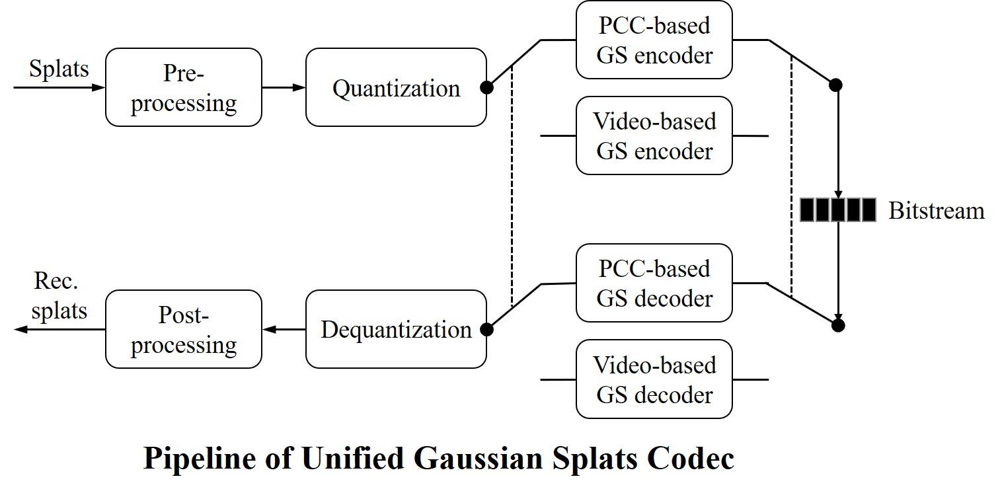
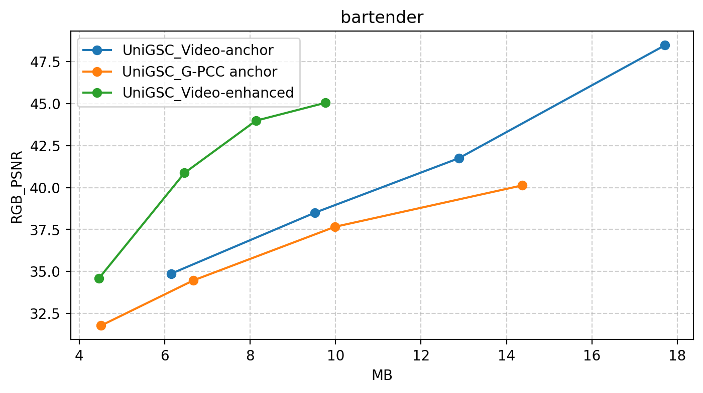
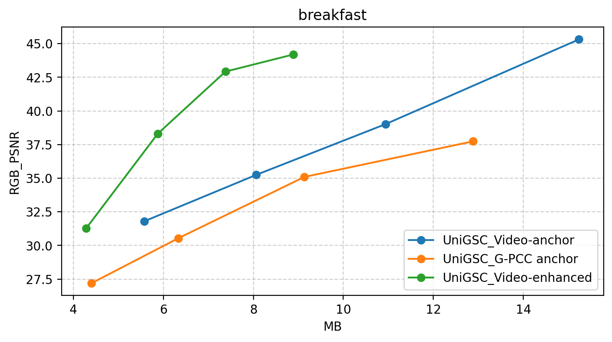
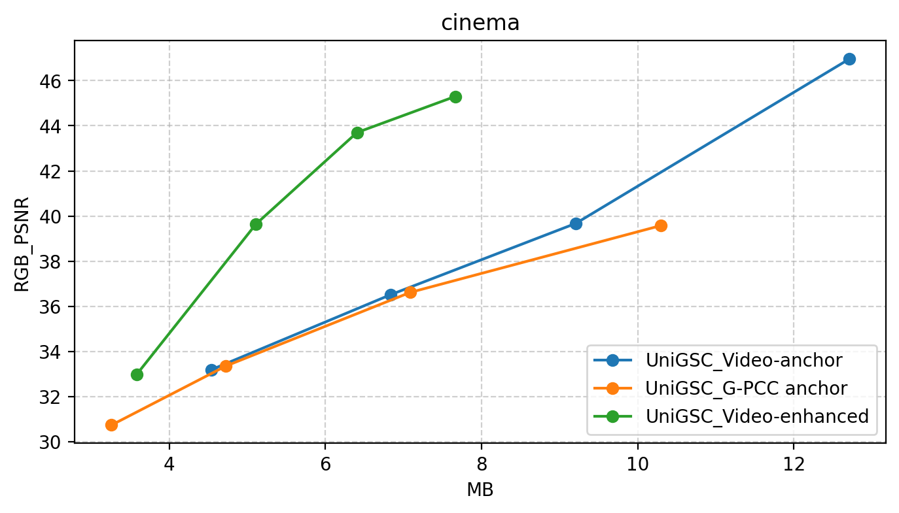

<!--
 * @Author: Zhiwei Zhu (zhuzhiwei21@zju.edu.cn)
 * @LastEditTime: 2025-10-03 23:46:06
 * @Description: README for UniGSC - Video-based Gaussian Splat Coding
-->

# 🚀 UniGSC: Unified Gaussian Splat Coding Platform

<!-- [](https://github.com/zhuzhiwei99/UniGSC/actions)
[](https://pypi.org/project/vgsc/)
[](https://pypi.org/project/vgsc/) -->




**UniGSC** is a highly modular and extensible framework for compressing **static and dynamic Gaussian splats**, supporting both video and point cloud codecs. It’s designed for **researchers and developers** to quickly prototype, evaluate, and extend Gaussian Splat compression pipelines.

---

## ✨ Highlights

- 🎯 **High-Efficiency Compression** tailored for Gaussian splats  
- 🧩 **Modular Architecture** enabling seamless algorithm and codec integration  
- 💻 **User-Friendly CLI** and Python API for flexible experimentation  
- 🛠️ **Comprehensive Tools** for logging, visualization, and benchmarking  
- 📦 Support for multiple **core codecs** (e.g., FFmpeg, HM, G-PCC)  
- 📜🌐 Built-in support for **MPEG GSC (Gaussian Splat Coding)** workflows  

---

## 📊 Benchmark
UniGSC provides a **one-stop benchmarking pipeline** for multiple codecs and configurations, enabling easy comparison across experiments. Below we show RD curves on the MPEG GSC dataset using different codecs and settings. We achieve **state-of-the-art performance** on multiple sequences.

The results can be reproduced using the scripts in the [Quick Start](#-quick-start) section.

<p float="left">
  
  
  
</p>


## ⚙️ Installation
Clone the repo 
```bash
git clone https://github.com/zhuzhiwei99/UniGSC.git  
cd UniGSC
```
Set up environment
```bash
conda create --name UniGSC python=3.10
conda activate UniGSC
```

Please install PyTorch first, you can choose the right command from [Pytorch](https://pytorch.org/get-started/locally/). For example, for CUDA 11.8:
```bash
pip install torch==2.3.1 torchvision==0.18.1 torchaudio==2.3.1 --index-url https://download.pytorch.org/whl/cu118 
```

Install the required packages
```bash
# Install UniGSC 
pip install .   # Or use `pip install -e .` for editable mode
# Install additional dependencies
pip install -r requirements.txt
```

---

## ⚡ Quick Start

### 📚 Prepare Dataset
Before running the scripts, make sure your dataset is placed in the `data/` directory and follows the recommended structure shown below:

<details>
<summary>Static Dataset structure</summary>

```bash
Static_dataset_name/
├── xxx.ply
│
└── colmap_data
    ├── images
    │   ├── 0000.png
    │   ├── 0001.png
    │   └── ...
    │   
    ├── sparse(/0)
    │   ├── cameras.bin
    │   ├── images.bin
    │   └── points3D.bin
    │
    └── (mask)
        ├── 0000.png
        ├── 0001.png
        └── ...
```
</details>


<details>
<summary>Dynamic Dataset structure</summary>

```bash
Dynamic_dataset_name/
├── plys
│   ├── frame_0000.ply
│   ├── frame_0001.ply
│   ├── ...
│   └── frame_NNNN.ply
│
└── colmap_data
    ├── frame_0000
    │   ├── images
    │   │   ├── 0000.png
    │   │   ├── 0001.png
    │   │   └── ...
    │   │   
    │   ├── sparse(/0)
    │   │   ├── cameras.bin
    │   │   ├── images.bin
    │   │   └── points3D.bin
    │   │
    │   └── (mask)
    │       ├── 0000.png
    │       ├── 0001.png
    │       └── ...
    │
    └── frame_NNNN
        ├── images
        │   ├── 0000.png
        │   ├── 0001.png
        │   └── ...
        ├── sparse(/0)
        │   ├── cameras.bin
        │   ├── images.bin
        │   └── points3D.bin
        │
        └── (mask)
            ├── 0000.png
            ├── 0001.png
            └── ...
```
</details>

<!-- ### 🌐 One-Stop MPEG GSC Benchmark Platform
Easily benchmark different MPEG GSC methods with our ready-to-use scripts.  
The following commands run the **full pipeline** (🗜️ encoding → 🔄 decoding → 🎨 rendering → 📊 evaluation) across codecs and configurations.  

💡 **Tip:** Render uncompressed views first — they serve as references for evaluation, so you won’t need to re-render them for each configuration.  

#### I-3DGS Main Track
Automatically process all sequences defined in the MPEG GSC CTC.  
Results will be saved in the `results/` directory.  
- Render uncompressed Gaussian Splats:
```bash
bash scripts/mpeg/main_render.sh
```
- Benchmark `MPEG GPCC JEE6.6`:
```bash
bash scripts/mpeg/main_benchmark.sh gpcc configs/gpcc/mpeg151/jee6.6
```
- Benchmark `MPEG Video-based GSC`:
```bash
bash scripts/mpeg/main_benchmark.sh vgsc configs/mpeg/151/video/video_anchor_ctc/
```
- Benchmark `UniGSC-VGSC`:
```bash
bash scripts/mpeg/main_benchmark.sh vgsc configs/mpeg/152/video/UniGSC-VGSC
```


#### I-3dGS 1 frame Track 
Automatically process all sequences defined in the MPEG GSC CTC for the **1f track**.
Results will be saved in the `results/` directory.
- Render uncompressed Gaussian Splats:
```bash
bash scripts/mpeg/1f_mandatory_render.sh
```

- Benchmark `MPEG GPCC JEE6.2 `:
```bash
bash scripts/mpeg/1f_mandatory_benchmark.sh gpcc configs/gpcc/mpeg151/jee6.2
```
- Benchmark `MPEG Video-based GSC`:
```bash
bash scripts/mpeg/1f_mandatory_benchmark.sh vgsc configs/mpeg/151/video/video_anchor_ctc/
```
- Benchmark `UniGSC-VGSC`:
```bash
bash scripts/mpeg/1f_mandatory_benchmark.sh vgsc configs/mpeg/152/video/UniGSC-VGSC
```
💡 For optional sequences, replace `mandatory` with `optional` in the script filenames. -->

### 🌐 One-Stop MPEG GSC Benchmark Platform

Easily benchmark different MPEG GSC methods with our ready-to-use scripts.  
The full pipeline covers **🗜️ Encoding → 🔄 Decoding → 🎨 Rendering → 📊 Evaluation**.  

💡 **Tip:** Render uncompressed views first — they serve as references, so you won’t need to re-render them for each configuration.


#### 🎬 I-3DGS Main Track

| Task | Command |
|------|---------|
| Render uncompressed Gaussian Splats | `bash scripts/mpeg/main_render.sh` |
| Benchmark **MPEG GPCC** | `bash scripts/mpeg/main_benchmark.sh gpcc configs/gpcc/mpeg151/jee6.2` |
| Benchmark **MPEG Video-based GSC** | `bash scripts/mpeg/main_benchmark.sh vgsc configs/mpeg/151/video/video_anchor_ctc/` |
| Benchmark **UniGSC-VGSC** | `bash scripts/mpeg/main_benchmark.sh vgsc configs/mpeg/152/video/UniGSC-VGSC` |

Results will be saved in the `results/` directory.


#### 🎬 I-3DGS 1-Frame Track

| Task | Command |
|------|---------|
| Render uncompressed Gaussian Splats | `bash scripts/mpeg/1f_mandatory_render.sh` |
| Benchmark **MPEG GPCC** | `bash scripts/mpeg/1f_mandatory_benchmark.sh gpcc configs/gpcc/mpeg151/jee6.6` |
| Benchmark **MPEG Video-based GSC** | `bash scripts/mpeg/1f_mandatory_benchmark.sh vgsc configs/mpeg/151/video/video_anchor_ctc/` |
| Benchmark **UniGSC-VGSC** | `bash scripts/mpeg/1f_mandatory_benchmark.sh vgsc configs/mpeg/152/video/UniGSC-VGSC` |

💡 For **optional sequences**, replace `mandatory` with `optional` in the script filenames.


### 📁 `results/` Folder Overview

| Name | Type | Description |
|------|------|-------------|
| `compression` | Directory | Compressed bitstreams produced by the codec. |
| `config` | Directory | Configuration files for each experiment. |
| `intermediate` | Directory | Temporary files from pre-processing and quantization steps. |
| `log` | Directory | Logs for the full pipeline. |
| `reconstructed` | Directory | Reconstructed Gaussian splats after decoding. |
| `renders` | Directory | Rendered images from uncompressed/reconstructed data. |
| `stats` | Directory | Evaluation statistics including bitrate, quality, timing, and plots. |
| `yuv` | Directory | Intermediate YUV video files used as codec input/output. |
| `rd_summary_GT.json` | File | Rate-Distortion metrics using ground truth images as reference. |
| `rd_summary_rendered.json` | File | Rate-Distortion metrics using uncompressed Gaussian Splat renders as reference. |


---


## 🧪 Usage Guide

### 🧱 Install Core codecs
As a Unified Gaussian Splat Coding framework, UniGSC requires core codecs for compression. We currently support FFmpeg, HM, G-PCC. 

We have provided prebuilt binaries for FFmpeg, HM and GPCC under `third_party/video_codec/bin/` directory, which you can use directly. If you prefer to build them from source, please refer to the [installation guide](./docs/install_codec.md).

To use custom codecs, place your encoder and decoder binaries in `third_party/video_codec/bin/` and and update the configuration accordingly.

### ⚙️ Configuration Files
UniGSC supports multiple codecs. You must specify the codec type and its corresponding settings via either command-line arguments or a `YAML` configuration file. The description of each command-line arguments can be found by running:
```bash
python gs_pipeline.py vgsc --help
python gs_pipeline.py gpcc --help
```

We recommend using `YAML` for better organization and maintainability. For complex experiments, you can create separate configuration files for different settings. 

Configuration files are located in the `configs/` directory. Example configurations:
<details> <summary>📄 <code>vgsc_config_example.yaml</code> </summary>
This example shows a typical configuration for UniGSC using FFmpeg. Not all fields are required—if omitted, default values will be used. You can override any of them via command-line arguments when running the scripts.

```yaml
codec: 
  video_codec_type: ffmpeg
  encoder_path: third_party/video_codec/bin/ffmpeg
  decoder_path: third_party/video_codec/bin/ffmpeg
  encode_config_path: null
  decode_config_path: null

  # Prune options
  prune_type: threshold
  prune_thres_opacities: -4
  
  # Transform options
  trans_quats_norm: true
  trans_sh0_ycbcr: false
  trans_shN_pca: true
  trans_shN_rank: 21

  # Quantize options
  quant_type: video_N01292
  quant_per_channel: true
  quant_shN_per_channel: false

  # Sorting options
  sort_type: plas
  sort_with_shN: true

  # YUV Chroma sub/up-sampling methods
  chroma_sub_method: average_pool
  chroma_up_method: bilinear
  
  # Video codec options
  gop_size: 16
  all_intra: false

  # QP config for each attribute
  qp_config:
    means_l: -1
    means_u: -1
    opacities: 7
    quats_w: 2
    quats_xyz: 2
    scales: 7
    sh0: 7
    shN_sh1: 7
    shN_sh2: 12
    shN_sh3: 17

  # Bit depth config for each attribute
  bit_depth_config:
    means_l: 8
    means_u: 8
    opacities: 10
    quats: 10
    scales: 10
    sh0: 10
    shN: 10

  # Pixel format for each attribute
  pix_fmt_config:
    means_l: yuv444p
    means_u: yuv444p
    opacities: yuv400p
    quats_w: yuv400p
    quats_xyz: yuv444p
    scales: yuv444p
    sh0: yuv444p
    shN: yuv444p

```
</details>


<details> <summary>📄 <code>gpcc_config_example.yaml</code> </summary>
This configuration is used for the GPCC codec (TMC13). All five fields are required.

```yaml
codec:
  quant_type: N00677
  encoder_path: third_party/pcc_codec/bin/gpcc/tmc3
  decoder_path: third_party/pcc_codec/bin/gpcc/tmc3
  encode_config_path: third_party/pcc_codec/cfg/gpcc/mpeg151/jee6.6/r01/encoder.cfg
  decode_config_path: third_party/pcc_codec/cfg/gpcc/mpeg151/jee6.6/r01/decoder.cfg
```
</details>


You can start with the provided configuration files and modify them according to your needs. 

- FFmpeg: `configs/ffmpeg/anchor_0.0/rp04.yaml` 
- HM:  `configs/hm/anchor_0.0/rp04.yaml` 

If you are interested in MPEG GSC workflows, please refer to the configurations under `configs/mpeg`. For example:
- Video-based GSC: `configs/mpeg/151/video/video_anchor_ctc/rp04.yaml`
- GPCC-based GSC: `configs/mpeg/151/gpcc/jee6.6/r04.yaml`


### 💻 Command-Line Interface
We provide command-line scripts to encode, decode, render, and evaluate Gaussian splats with different codecs:
| Script              | Description                                              |
| ------------------- | -------------------------------------------------------- |
| `gsc/runner.py`      | Defines the core workflow: pre_process, quantize, encode, decode, dequantize, and post_process of Gaussian splats |
| `gs_pipeline.py`    | Entry point for running experiments with different pipelines                                    |


🎯 Supported GSCodec Types
- `vgsc`: Video-based Gaussian Splat Coding 
- `gpcc`: GPCC-based Gaussian Splat Coding 

▶️ Example Command

```bash
CUDA_VISIBLE_DEVICES=0 python gs_pipeline.py \
    vgsc \
    --config configs/ffmpeg/anchor_0.0.yaml \
    --pipe_stage benchmark \
    --ply_dir ./data/scene/ply \
    --data_dir ./data/scene/colmap \
    --result_dir ./results/scene_anchor_0.0 \
    --frame_num 50 \
    --test_view_id 0 \
    --codec.gop_size 16
```

ℹ️ Get Help

```bash
python gs_pipeline.py vgsc --help
python gs_pipeline.py gpcc --help
```

## 📝 Scripts for Common Workflows
### ▶️ Run UniGSC-VGSC (Video-based Gaussian Splats Codec) 
Run the UniGSC framework with **FFmpeg** as the video codec. To switch to other codecs (e.g., **HM**), replace `ffmpeg` with `hm`.  
> FFmpeg: faster; HM: higher compression at the cost of speed.

Use the provided configuration files in `configs/` to specify codec settings. 

Run `bash scripts/<script_name>.sh` for help on each script.

#### One-Click Benchmark
```bash
bash scripts/benchmark.sh 1 gsc_dynamic data/GSC_splats/m71763_bartender_stable/colmap_data data/GSC_splats/m71763_bartender_stable/track vgsc configs/ffmpeg/anchor_0.0
```
Results are saved in: `results/m71763_bartender_stable/track/frame1/configs/ffmpeg/anchor_0.0`.
#### Run Steps Individually

You can also execute each step individually:
| Step | Command |
|------|---------|
| 🗜️ **Encode** | ```bashbash scripts/encode.sh 1 data/GSC_splats/m71763_bartender_stable/track vgsc configs/ffmpeg/anchor_0.0``` |
| 🔄 **Decode** | ```bashbash scripts/decode.sh 1 data/GSC_splats/m71763_bartender_stable/track vgsc configs/ffmpeg/anchor_0.0``` |
| 📊 **Evaluate** | ```bashbash scripts/eval.sh 1 gsc_dynamic data/GSC_splats/m71763_bartender_stable/colmap_data data/GSC_splats/m71763_bartender_stable/track results/GSC_splats/m71763_bartender_stable/track/frame1/configs/ffmpeg/anchor_0.0``` |


<!-- - Render

```bash
bash scripts/render.sh 1 bartender data/GSC_splats/m71763_bartender_stable/track
```

- Encode

```bash
bash scripts/encode.sh 1 data/GSC_splats/m71763_bartender_stable/track vgsc configs/ffmpeg/anchor_0.0
```

- Decode

```bash
bash scripts/decode.sh 1 data/GSC_splats/m71763_bartender_stable/track vgsc configs/ffmpeg/anchor_0.0
```

- Evaluate

```bash
bash scripts/eval.sh 1 gsc_dynamic data/GSC_splats/m71763_bartender_stable/colmap_data data/GSC_splats/m71763_bartender_stable/track results/GSC_splats/m71763_bartender_stable/track/frame1/configs/ffmpeg/anchor_0.0
``` -->


### ▶️ Run UniGSC-GPCC (PCC-based Gaussian Splats Codec)
UniGSC also supports point cloud codecs, e.g., MPEG GPCC (TMC13), allowing Gaussian splats to be compressed as point clouds.

Benchmark the MPEG GPCC codec using:

```bash
bash scripts/benchmark.sh 1 gsc_dynamic data/GSC_splats/m71763_bartender_stable/colmap_data data/GSC_splats/m71763_bartender_stable/track gpcc configs/gpcc/mpeg151/jee6.6
```


## 🐍 Using the UniGSC Python API
In short, the UniGSC Python API allows researchers and developers to:

* Load Gaussian splat datasets
* Apply pre-processing, including pruning, transformation, etc.
* Perform flexible quantization with customizable bit depth and channel control
* Encode and decode splats with video or point cloud codecs
* Render and evaluate reconstructed results

<details> <summary>📄 <code>UniGSC API Usage Examples</code> </summary>

```python
from gsc.runner import Runner, VgscCodecConfig

# Create a codec configuration
config = VgscCodecConfig(
    ply_dir="data/scene/ply",
    data_dir="data/scene/colmap",
    result_dir="results/scene",
    codec_type="vgsc",
    video_codec_type="ffmpeg",
    encoder_path="third_party/video_codec/bin/ffmpeg",
    decoder_path="third_party/video_codec/bin/ffmpeg",
    frame_num=1,
)

# Initialize the UniGSC pipeline
runner = Runner(
  local_rank=0,
  world_rank=0,
  world_size=1,
  cfg=config)

# Load Gaussian splats
runner.load_ply_sequence()
# Preprocess 
runner.preprocess()
# Quantize 
runner.quantize()
# Encode 
runner.encode()
# Decode
runner.decode()
# Dequantize
runner.dequantize()
# Postprocess
runner.postprocess()
# Render and evaluate
runner.eval()

```
---</details>


## 📁 Project Structure

| Directory      | Description                                                                 |
| -------------- | --------------------------------------------------------------------------- |
| `assets/`      | Demo assets, such as teaser images                                          |
| `configs/`     | Configuration files for different compression settings                      |
| `data/`        | Gaussian Splat datasets (PLY point clouds and COLMAP data)                  |
| `datasets/`    | Dataset handling and loading scripts                                        |
| `docs/`        | Documentation and installation guides                                       |
| `results/`     | Encoded bitstreams, rendered views, evaluation metrics, etc.                |
| `scripts/`     | Helper scripts for automating workflows                                     |
| `third_party/` | External dependencies (e.g., FFmpeg, HM, GPCC, fine-tuning tools)           |
| `utils/`       | Utility functions (I/O, metrics, plotting, summaries, etc.)                 |
| `gsc/`        | Core framework modules (codecs, mapping, preprocessing, quantization, etc.)  |


## 📄 Citation

If you find this project useful, please consider giving it a star.

---

## 👥 Contributors

- Zhiwei Zhu · zhuzhiwei21@zju.edu.cn  
- Sicheng Li · jasonlisicheng@zju.edu.cn  

If you have any questions about this project, please feel free to contact us.

---

## 🙏 Acknowledgements

This project is built upon:

- [GSCodec_Studio](https://github.com/JasonLSC/GSCodec_Studio)
- [3D Gaussian Splatting](https://github.com/graphdeco-inria/gaussian-splatting)
- [gsplat](https://github.com/nerfstudio-project/gsplat)

Thanks to all the great open-source contributors! ❤️
