<!--
 * @Author: Zhiwei Zhu (zhuzhiwei21@zju.edu.cn)
 * @Date: 2025-10-23 10:56:57
 * @LastEditors: Zhiwei Zhu (zhuzhiwei21@zju.edu.cn)
 * @LastEditTime: 2025-10-23 12:11:13
 * @FilePath: /UniGSC/docs/benchmark/mpeg152.md
 * @Description: 
 * 
 * Copyright (c) 2025 by Zhiwei Zhu, All Rights Reserved. 
-->
## 📊 Benchmark
UniGSC provides a **one-stop benchmarking pipeline** for multiple codecs and configurations, enabling easy comparison across experiments. Below we show RD curves on the MPEG GSC dataset using different codecs and settings.  **UniGSC-video_enhanced** achieve **state-of-the-art performance** on multiple sequences.

The results can be reproduced using the scripts in the [Quick Start](../../README.md#-quick-start) section.

### MPEG I-3DGS 1-Frame Track

#### **Video** Track

  **UniGSC-video_ctc** follows the MPEG GSC Common Test Conditions (CTC) [1] and consistently outperforms other video-based GSC methods [2-4] across all forward-facing sequences.

  **UniGSC-video_enhanced** further improves compression performance by leveraging enhanced configurations implemented within the UniGSC framework. Configuration files are available at: [UniGSC_video_enhanced](../../examples/configs/mpeg/152/video/video_enhanced)

  
  
  

#### **PCC** Track
  **UniGSC-gpcc_ctc** is a GPCC-based GSC method implemented following [5], using MPEG GPCC (TMC3) as the core codec.

  **UniGSC-gpcc_enchaned** is an enhanced GPCC-based GSC method proposed in [6], which improves compression performance by combining lifting and predictive transforms for attribute coding. Configuration files are available at: [UniGSC_gpcc_enhanced](../../examples/configs/mpeg/151/gpcc/m73385_octree-predlift/Combined_Predlift)

  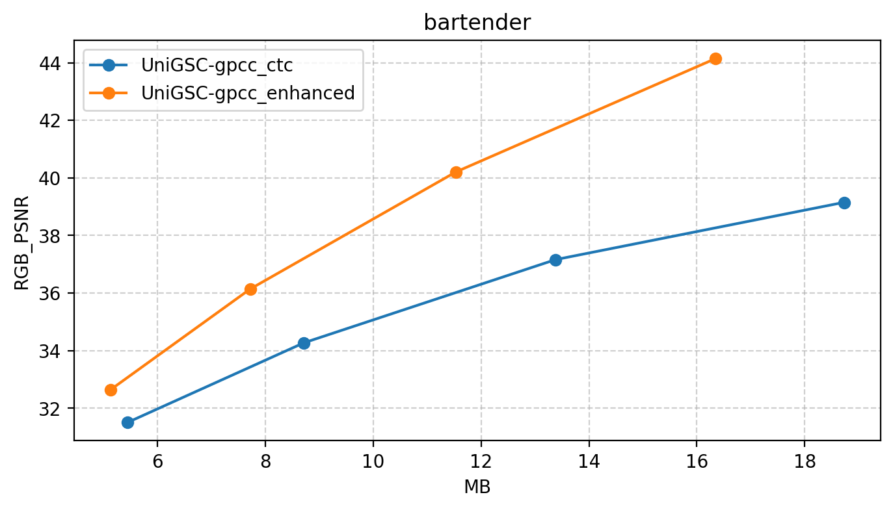
  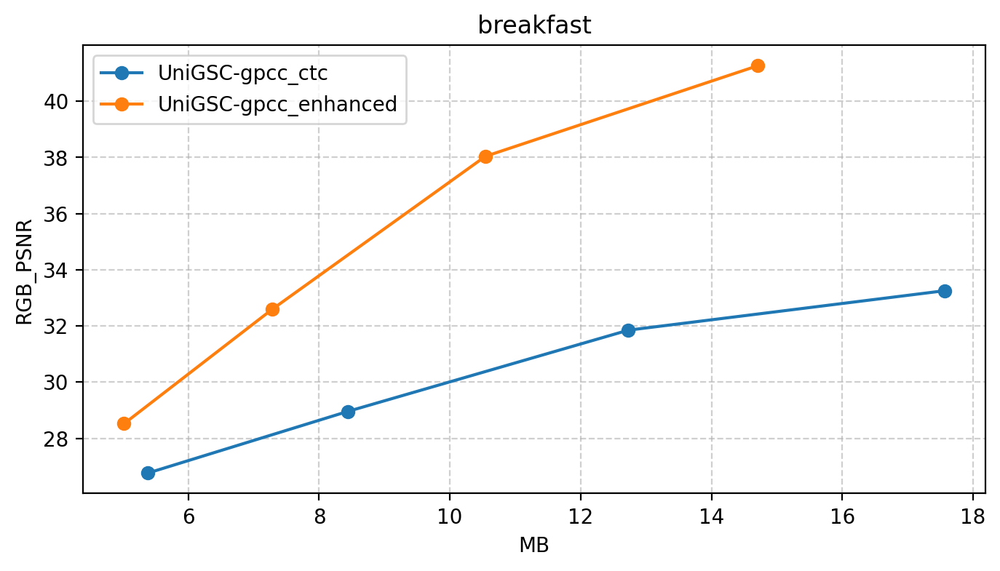
  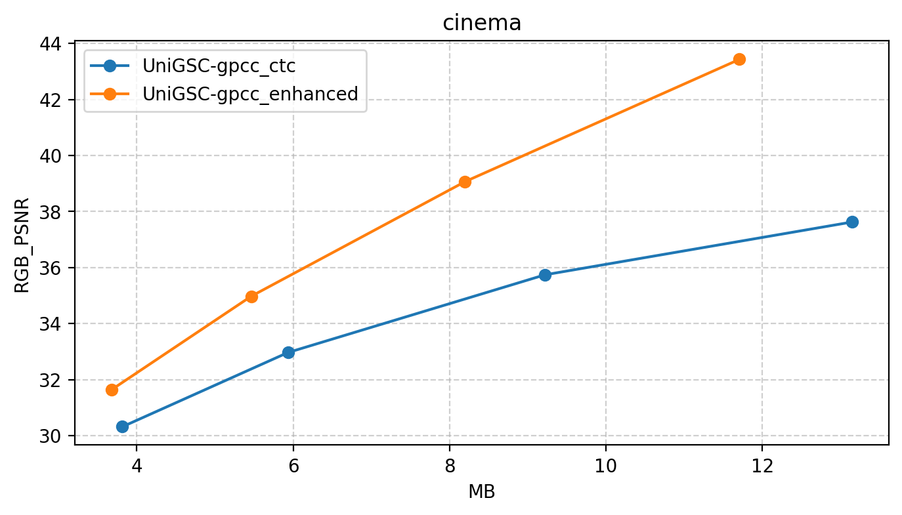

####  **Video vs. Point Cloud**
Currently, video-based approaches generally outperform point cloud-based ones in forward-facing sequences, whereas point cloud-based methods exhibit advantages in object-centric sequences, especially at low bitrates.
-  Forward-facing Sequences

  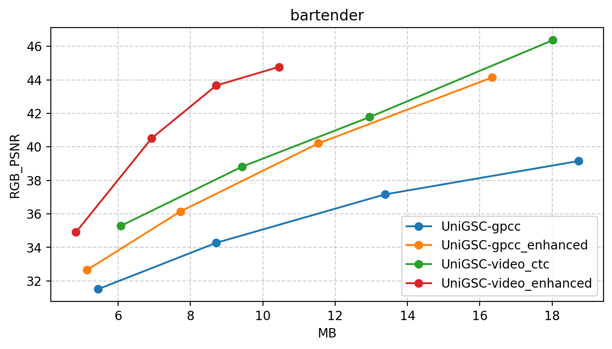
  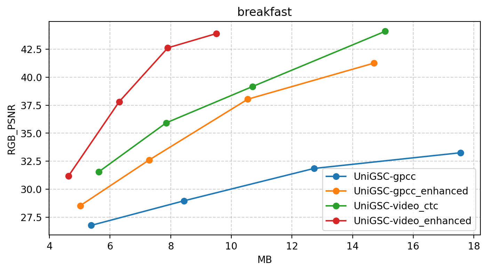
  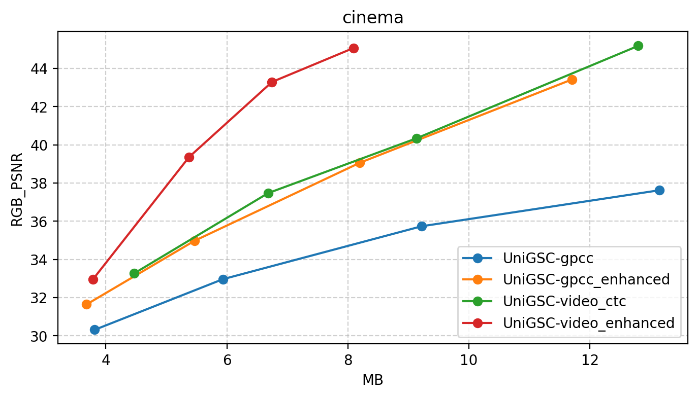

- Object-centric Sequences

  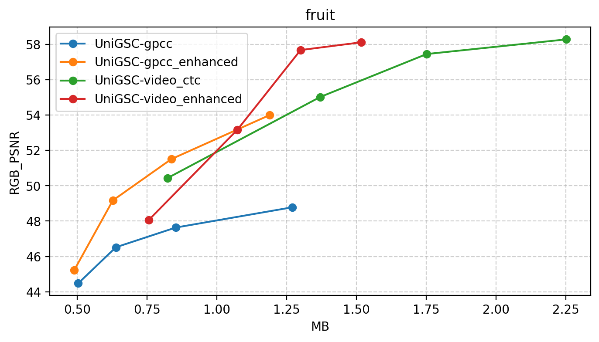
  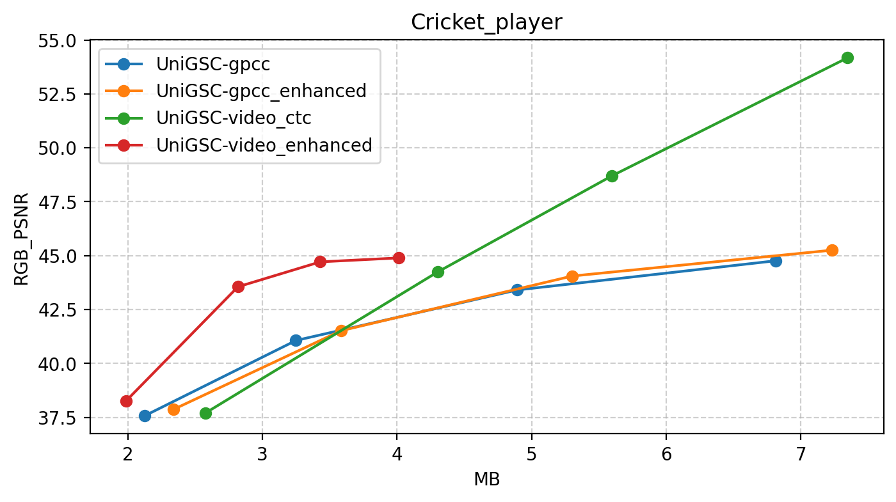
  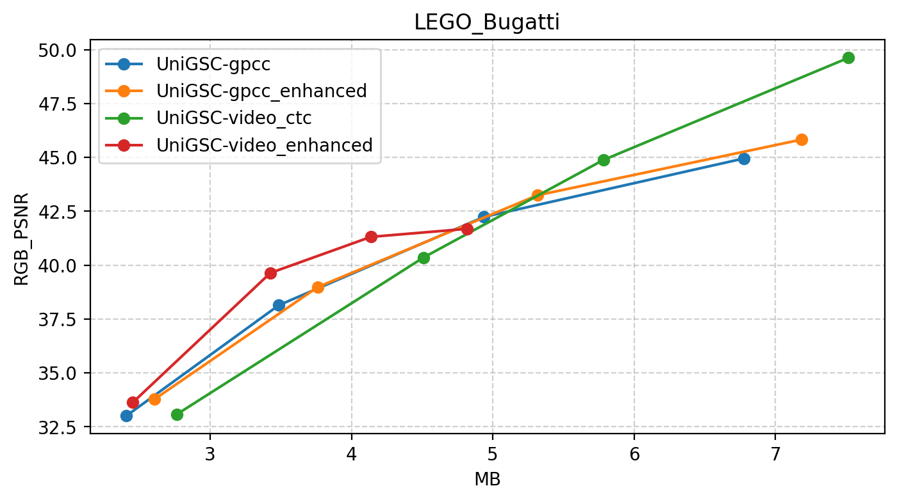

  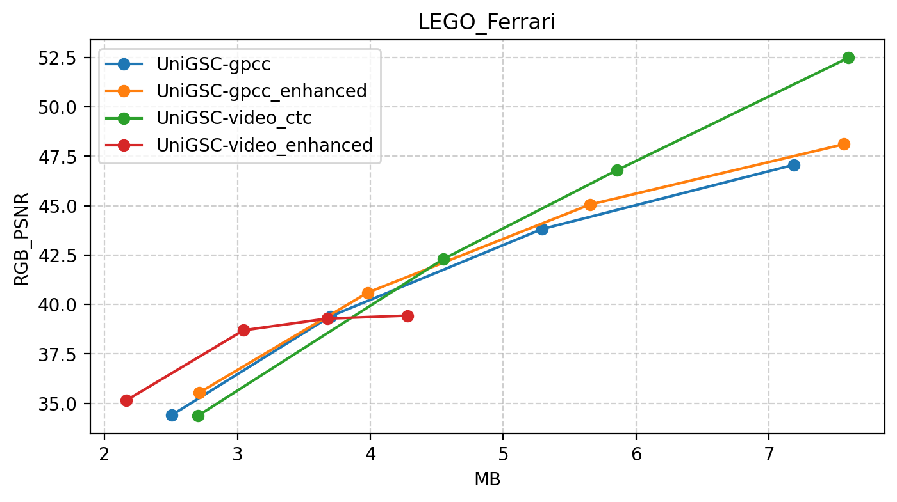
  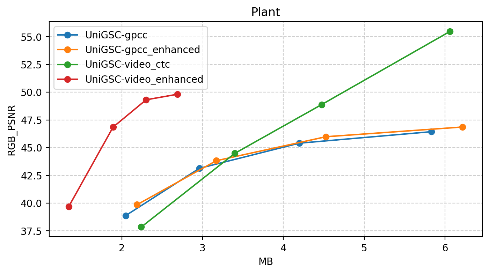
  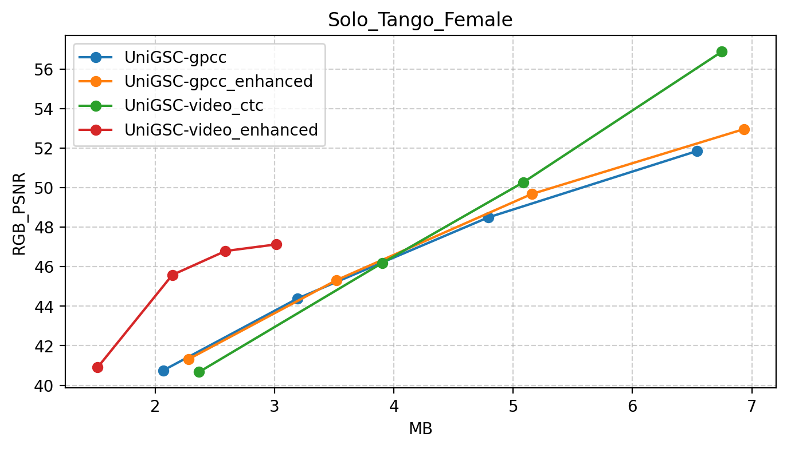

  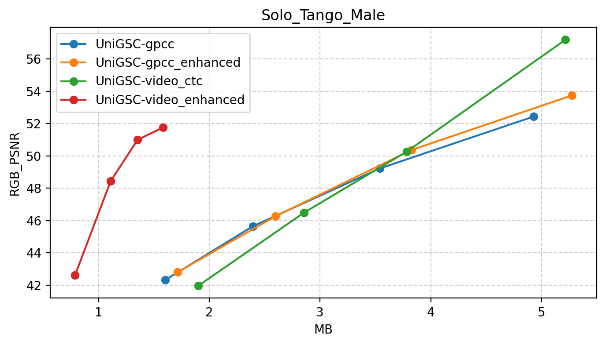
  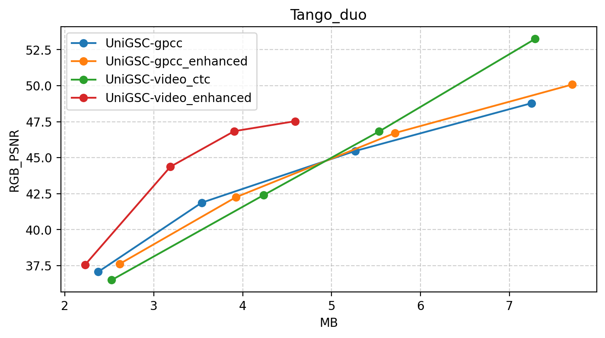
  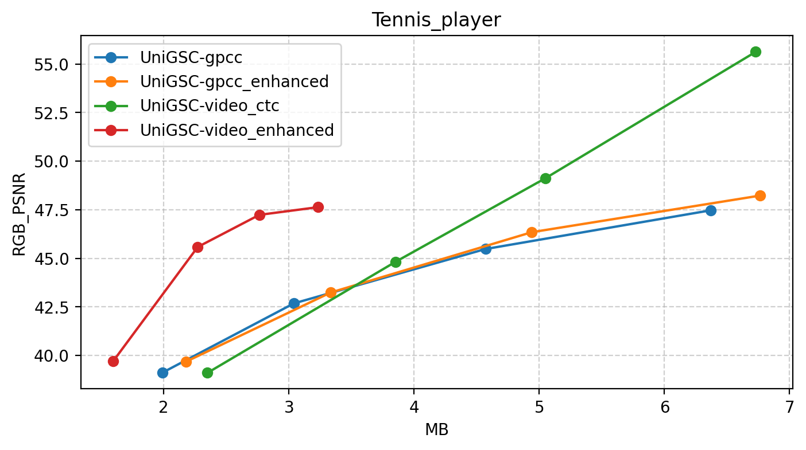

  >[1] “Draft CTC for Gaussian Splat Coding,” ISO/IEC JTC1/SC29/WG04 N01292, Daejeon, June 2025.  
  >[2] “[GSC][JEE6.7] Report on JEE6.7 Task 2: 1f-track video-based solution from ZJU for GSC anchor generation,” ISO/IEC JTC1/SC29/WG04 m74704, Geneva, October 2025.  
  >[3] “[GSC][V3C][V-PCC][JEE6.7] Performance of V-PCC RAW toolset for Gaussian Splatting,” ISO/IEC JTC1/SC29/WG04 m73977, Geneva, October 2025.  
  >[4] “[GSC][JEE6.7] Report on the performance of V-PCC platform for GSC,” ISO/IEC JTC1/SC29/WG04 m74012, Geneva, October 2025.  
  >[5]“[GSC][JEE6.6] Report on JEE6.6-Test6 anchor and additional references,” ISO/IEC JTC1/SC29/WG04 m73982, Geneva, October 2025.  
  >[6]“[GSC][JEE6.6-related] Predlift performance comparison to RAHT,” ISO/IEC JTC1/SC29/WG07 m73385, Daejeon, June 2025.